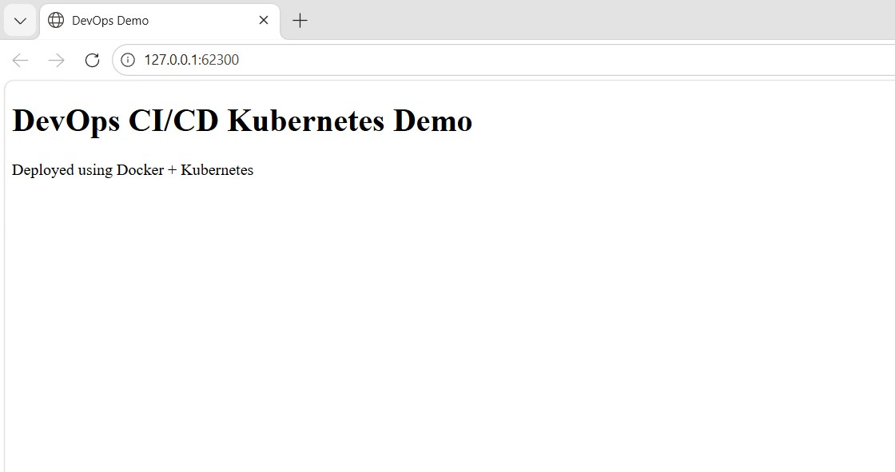
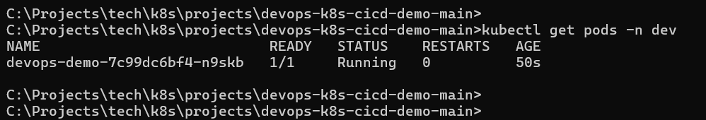
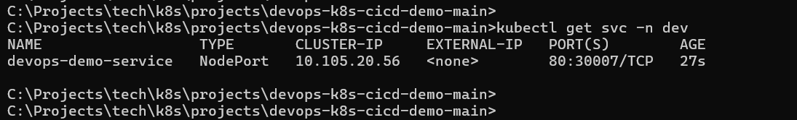

# DevOps CI/CD Pipeline with Kubernetes Deployment


## Overview

A end-to-end DevOps pipeline demonstrating containerisation, 
Kubernetes orchestration, and CI/CD automation — built to 
reflect real-world enterprise deployment workflows.

## Architecture

```
GitHub (source)
    ↓ push trigger
Jenkins CI/CD Pipeline
    ↓ build
Docker Image
    ↓ push
Docker Hub Registry
    ↓ pull & deploy
Kubernetes Cluster (Minikube)
    ├── Deployment (2 replicas)
    └── Service (NodePort)
```

## Tech Stack

| Tool | Purpose |
|---|---|
| Docker | Application containerisation |
| Kubernetes (Minikube) | Container orchestration |
| Jenkins | CI/CD pipeline automation |
| Docker Hub | Container image registry |
| kubectl | Kubernetes CLI management |
| Shell scripting | Automation and deployment |

## What This Project Demonstrates

- **Container orchestration** — Kubernetes Deployment and 
  Service configuration with replica management
- **CI/CD automation** — Jenkins pipeline for automated 
  build, tag, push, and deploy workflow
- **Infrastructure as code** — Kubernetes manifests 
  (deployment.yaml, service.yaml) for reproducible deployments
- **DevOps best practices** — separation of build and deploy 
  stages, image versioning, environment configuration

## Prerequisites

- Docker installed and running
- Minikube installed (`minikube start`)
- kubectl configured
- Jenkins running locally or on a server
- Docker Hub account

## Project Structure

```
devops-k8s-cicd-demo/
├── app/                    # Application source code
│   └── index.html
├── screenshots/            # Pipeline and deployment screenshots
├── Dockerfile              # Container image definition
├── Jenkinsfile             # CI/CD pipeline definition
├── README.md               # Project documentation
├── deployment.yaml         # Kubernetes Deployment manifest
└── service.yaml            # Kubernetes Service manifest
```

## CI/CD Pipeline Stages

The Jenkins pipeline executes the following stages:

1. **Checkout** — Pull latest source from GitHub
2. **Build** — Build Docker image from Dockerfile
3. **Push** — Push versioned image to Docker Hub
4. **Deploy** — Apply Kubernetes manifests to cluster

## How to Run

### 1. Start Minikube
```bash
minikube start
```

### 2. Build Docker Image
```bash
docker build -t prabathmkdocker/devops-demo:v2 .
```

### 3. Push to Docker Hub
```bash
docker push prabathmkdocker/devops-demo:v2
```

### 4. Deploy to Kubernetes
```bash
kubectl apply -f deployment.yaml
kubectl apply -f service.yaml
kubectl get pods
kubectl get services
```

### 5. Access Application
```bash
minikube service devops-demo-service
```

## Screenshots

### CI/CD Pipeline Output
*(Add Jenkins pipeline screenshot here)*

### Application Running

*Application successfully deployed on Kubernetes*

### Kubernetes Pods

*Pods running in Kubernetes cluster*

### Kubernetes Service

*NodePort service exposing the application*

## Roadmap — Planned Enhancements

- [ ] Migrate image registry from Docker Hub to **AWS ECR**
- [ ] Add **Terraform** configuration for AWS infrastructure
- [ ] Add **GitHub Actions** workflow alongside Jenkins
- [ ] Add **Prometheus + Grafana** monitoring manifests
- [ ] Add **Helm chart** for parameterised deployments

## Author

**Prabath Kariyawasam**  
DevOps & SRE Engineer | Kubernetes | AWS | CI/CD  
[LinkedIn](https://www.linkedin.com/in/prabath-kariyawasam) | 
[GitHub](https://github.com/prabathmk)
